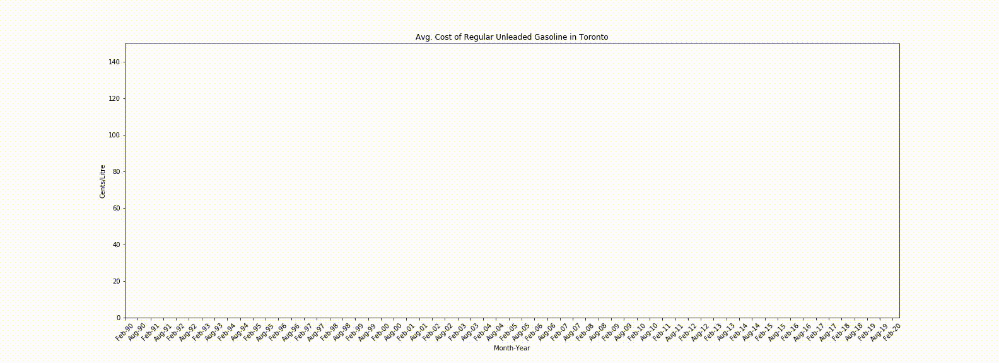

# Toronto Fuel Price from 1990 to 2020
## Animated Graph to show the price change in the last 30 years

Full code can be found in my [Jupyter Notebook](https://github.com/Shafquat/Toronto-Fuel-Price/blob/master/Gas-script.ipynb)

## Data Sources: 

The Datasource comes from Statistics Canada. Specifically[Monthly average retail prices for gasoline and fuel oil, by geography](https://www150.statcan.gc.ca/t1/tbl1/en/cv!recreate.action?pid=1810000101&selectedNodeIds=1D9,2D2&checkedLevels=&refPeriods=19900201,20200201&dimensionLayouts=layout3,layout2,layout2&vectorDisplay=false) 

It should be noted that for this visualization, the March 2020 numbers were estimated at 75 cents/litre and the April 2020 dummy numbers were added in so that the animation did not cut the March nubmers off.

Special thanks to [u/sync-centre](https://www.reddit.com/r/toronto/comments/fov9y9/oldschool_gas_prices/flhddmh) for showing me this resource.

### Prerequisites

Python and Jupyter Notebook are required to run the iPython Notebooks

The following python packages are required to replicate this noteboook:
* Pandas
* Numpy
* Matplotlib
** Pyplot
** Animation
* ffmpeg
* IPython
** Display.HTML

## Authors

* **Shafquat Arefeen** - [Shafquat Arefeen](https://shafquatarefeen.com)
